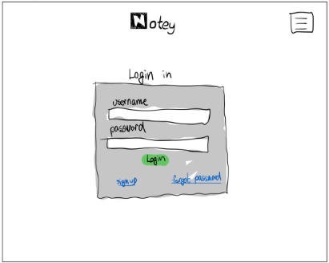

## Functional Requirements
1. Create Account (User should be able to create an account)
2. Log in (Users should have the option to Log in to an account)
3. Create Notes (User should be able to create a new note)
4. Attach Files/images (User should be able to add images/files to their notes)
5. Search Notes (Users should be able to search for specific notes)
6. Delete Notes (The user should be able to delete notes from their account)
7. Edit Notes (Users should have the ability to make changes or updates to their existing notes)
8. *Connect with any external API (The app should allow to integrate external APIs to provide additional functionality or data)
9. Log Out (Users should be able to sign out of their accounts)
10. Share Notes (Users should be able to share their notes with other users)
11. Edit User Profiles (Users should be able to modify and update their user profiles)
12. *Advance search items with regular expressions (User should be able to perform advanced searches on their notes)
13. *Visualize note connections (Users should be able to visualize how their notes are related to each other)

## Non-functional Requirements
1. *Multilingual Support (Support contents in multiple languages)
2. Account Verification (The system should implement secure and efficient account verification processes)

## Use Cases
### 1. Sign up
- **Author:** Rodrigo (@Rodarkhen)
- **Pre-condition:** 
  - User is not registered on the platform.
- **Trigger:** 
  - Users clicks on the "Sign up" button.
- **Primary Sequence:** 
  1. User clicks "Sign up"
  2. User is prompted to the sign up page
  3. User enters necessary information
  5. System validate information entered
  6. The system creates the account if it passes validation
  7. User can now log in and access the application
- **Primary Postconditions:**
  - User has now a registered account and can access the app.
- **Alternate Sequence:** 
  1. User enters invalid information (e.g., email format is incorrect).
  2. The system displays an error message.
  3. User fixs the information.
  4. User clicks the "Sign up" button again.

### 2. Log in
- **Author:** Nikola
- **Pre-condition:**
  - The user must have the application running. 
- **Trigger:**
  - The user clicks the log in button on the main menu screen. 
- **Primary Sequence:** 
  1. User Enters the username string associated with their account. 
  2. User clicks on the password text box
  3. User enters the password string associated with their account. 
  4. User either hits the 'enter' button on their device or clicks the button on the screen. 
- **Primary Postconditions:**
  - The user is successfully logged into their account 
- **Alternate Sequence:** 
  1. The user clicks the "create account" button 
  2. The user enters the email, username, and password for their account 
  3. The user clicks the "submit" button

### 3. **Create Notes**
- **Author:** Anik (@AnikBudhathoki)
- **Pre-condition:** 
  - The user must be logged into their personal account.
- **Trigger:**
  - The user clicks the create new note option.
- **Primary Sequence:**
  1. User clicks the "New Notes" option in the webpage
  2. User is presented with a blank note-taking template 
  3. User enters information in the title field and the contents field
  4. User clicks the "Save" button
  5. User enters name of the save
  6. System validates the notes to make sure all fields are entered (ie. Make sure title field is not missing)
  7. System prompts message stating the save was successful
- **Primary Postconditions:**
    - The user's notes are saved under their account
- **Alternate Sequence:**
  1. System presents an error message prompting user to fill out missing information (ie. Title name)
  2. User presented option to type in missing fields
  3. System validates notes again to make sure all fields are entered properly

### 4. Attach Files/Images
- **Author:** Anik (@AnikBudhathoki)
- **Pre-condition:** 
  - The user must be logged into their personal account and on an existing note they want to edit.
- **Trigger:**
  - The clicks the "Attachments" option.
- **Primary Sequence:**
  1. The user clicks attach files option
  2. The system prompts the user with a file-picking dialogue
  3. User selects the files/images they want and clicks submit
  4. The system validates and uploads files onto notes
  5. The system prompts the user with a message validating if the upload was successful
- **Primary Postconditions:**
  - The user's notes are saved under their account
- **Alternate Sequence:**
  1. System prompts the user with an error message relating to image/file upload
  2. User presented the option to select another file for uploading
  3. The user selects files again and step v of the primary sequence is repeated

### 5. Search Notes
- **Author:** Rodrigo (@Rodarkhen)
- **Pre-condition:**
  - The user is logged into their account.
- **Trigger:**
  - The user initiates a search action from the search bar.
- **Primary Sequence:** 
  1. User enters search keywords or criteria in the search bar.
  2. The system looks for notes that match the search terms in the database.
  3. The system displays a list of matching notes in the search results.
  4. User can click on a search result to view the full note.
- **Primary Postconditions:**
  - The user is presented with a list of notes that match the search criteria.
- **Alternate Sequence:** 
  1. User enters search keywords, but no matching words are found.
  2. The system displays a not-found message.

### 6. Delete Notes
- **Author:** Anik (@AnikBudhathoki)
- **Pre-condition:** 
  - The user must be logged into their personal account and on an existing note they want to edit
- **Trigger:**
  - The clicks the "Delete" option
- **Primary Sequence:**
  1. The user selects the note they wish to delete from their collection of notes
  2. The user clicks on the "Delete" button
  3. The system prompts a message asking user to confirm their deletion action
  4. The user confirms their selection
  5. The system deletes the note from user's registered account
  6. System confirms that the note has been successfully deleted and provides a message to the user
- **Primary Postconditions:**
  - The note is deleted from the users account
  - The note no longer shows up in the users collection of notes
- **Alternate Sequence 1:**
  1. User decides not to proceed with their deletion and presses the "Cancel" option
  2. The system returns the user back to the note viewing page
- **Alternate Sequence 2:**
  1. System prompts an error during deletion(ex. server, database error) to the user
  2. A message is displayed to the user to try again later

### 7. Edit Notes
- **Author:** Nikola
- **Pre-condition:**
  - The user must be logged into their personal account and on an existing note they want to edit
- **Trigger:**
  - The user clicks the "edit notes" button 
- **Primary Sequence:**
  1. User selects an existing note in the application.
  2. The user makes the intended changes to the note.
  3. User may add or remove text, images, or other content within the note.
  4. The user clicks the "save changes" button 
- **Primary Postconditions:**
  - The system places the user in a viewer only mode again, unable to make changes 
- **Alternate Sequence:** 
  1. The user is prompted with an error message, "you are unable to edit at this time" 

### 8. *Connect with any external API
- **Author:** Nikola
- **Pre-condition:**
  - The user is logged into the web application.
- **Trigger:**
  - Requires interaction with an external API,
- **Primary Sequence:** 
  1. User initiates the action to interact with an external API.
  2. The external API processes the request and provides a response.
  3. The application receives and processes the data from the external API.
  4. The relevant data or information from the API response is displayed or used within the web application as needed.
  5. The user can continue to use the application with the retrieved data or perform further actions.
- **Primary Postconditions:**
  - The application successfully connects with the external API and retrieves the required data for the user to interact with.
- **Alternate Sequence:** 
  1. Interacting with the API fails
  2. The application displays an error message to the user.
  3. The user may be prompted to connect with the API again

### 9. Log Out
- **Author:** Nikola
- **Pre-condition:**
  - The user must be logged into their account
- **Trigger:**
  - The user clicks the "log out" button 
- **Primary Sequence:** 
  1. The user clicks the settings symbol 
  2. The user clicks the log out button in the dropdown 
  3. The system returns the user to the main menu login screen 
- **Primary Postconditions:**
  - The users account is no longer designated as logged in 
- **Alternate Sequence:** 
  1. The user is prompted with an error message that the system was unable to log them out

### 10. Share Notes
- **Author:** Rodrigo (@Rodarkhen)
- **Pre-condition:**
  - The user must be logged into their account.
- **Trigger:**
  - User clicks the "Share" button.
- **Primary Sequence:** 
  1. User selects a note they want to share
  2. User clicks the "Share" button
  3. The system generates a shareable link for the selected note
  4. User can copy and share the link with others through email or messaging apps
  5. Anyone with the link can view the shared note without needing an account
- **Primary Postconditions:**
  - The selected note is successfully shared with the recipient.
- **Alternate Sequence:** 
  1. User enters an invalid or non-existent recipient email or username
  2. An error message about the recipient's information is displayed
  3. User must changes the correct recipient information to proceed with sharing

### 11. Edit User Profiles
- **Author:** Rodrigo (@Rodarkhen)
- **Pre-condition:**
  - The user is logged into their account.
- **Trigger:**
  - The user clicks "Account" to initiate profile edit action
- **Primary Sequence:** 
  1. User clicks on the "Account" or "Settings" option.
  2. User can modify personal information such as name, email, profile picture
  3. User saves the changes
  4. A confirmation message is shown that their profile has been updated.
  5. The system saves the new profile information on the database
- **Primary Postconditions:**
  - The user's profile is updated.
- **Alternate Sequence:** 
  1. User makes changes to their profile but decides to cancel.
  2. User clicks the "Cancel" or "Discard Changes" button.
  3. No changes is made.

### 12. Advanced search items with regular expressions
- **Author:** Rodrigo (@Rodarkhen)
- **Pre-condition:**
  - User is logged into their account.
- **Trigger:**
  - User clicks on "advanced search" bar.
- **Primary Sequence:** 
  1. User clicks the advanced search option.
  2. User enters a regular expression or search for a term in the search bar.
  3. A search using the regular expression or term is performed.
  4. A list of items that match the search criteria is displayed.
- **Primary Postconditions:**
  - The user is presented with a list of matched items.
- **Alternate Sequence:** 
  1. No matching items are found.
  2. A message is displayed indicating no results were found.
